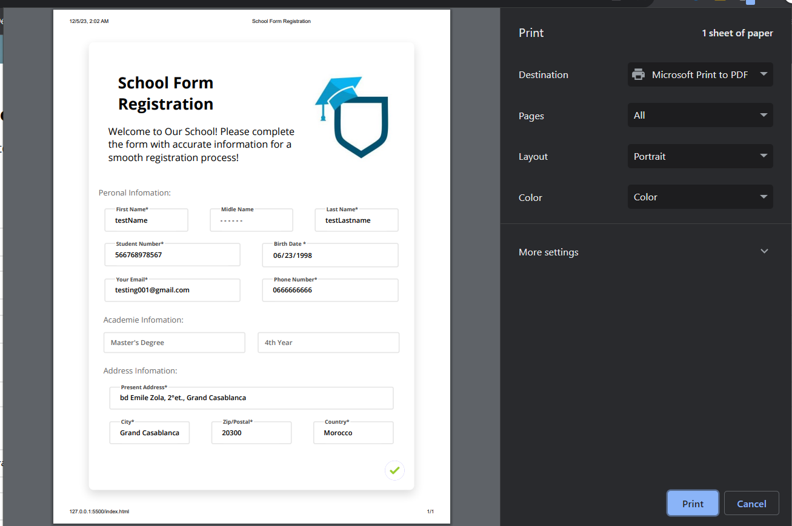
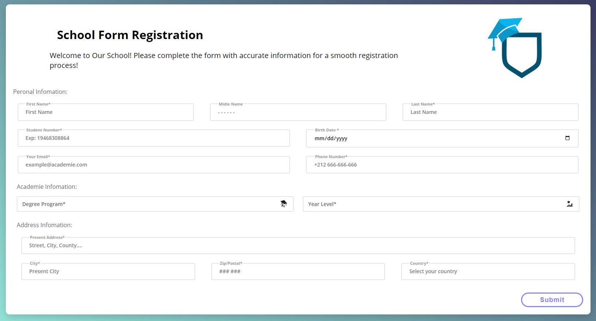

# School Form Register

Welcome to the School Form Register project! This web application allows users to register for school by filling out a form. The project is built using HTML, CSS, and JavaScript to ensure a seamless and responsive experience across all devices.

## Features

- User-friendly registration form.
- Responsive design for various screen sizes (desktops, tablets, and mobile devices).
- Form validation to ensure accurate and complete information.

## Technologies Used

- HTML
- CSS
- JavaScript

## Screenshots

## Usage

1. Fill out the registration form with accurate information.

2. Click the "Submit" button to register.

## Responsive Design

The project is designed to be responsive across various devices. The use of media queries in the CSS ensures an optimal viewing experience for users on desktops, tablets, and mobile devices.

## Form Validation

JavaScript is utilized to provide form validation and ensure that users enter valid information. Error messages will be displayed if any required fields are left blank or if invalid data is entered.
